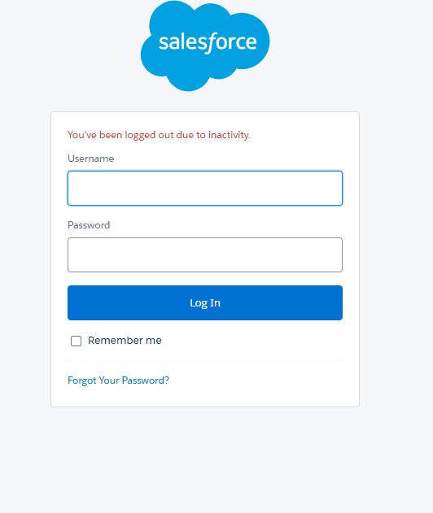

# Payment Plan Lightning Web Component

## Overview

This Lightning Web Component (LWC) provides a user interface for calculating and managing payment plans within Salesforce. It allows users to define payment terms, calculate monthly installments (EMIs), and visualize the payment schedule. The component interacts with Salesforce Apex classes to fetch data, save payment details, and perform gross margin checks.

## Features

- **Dynamic Payment Calculation:** Calculates monthly installments (EMIs) based on principal amount, interest rate, and tenure.
- **EMI Schedule Visualization:** Displays a detailed payment schedule with due dates, principal amounts, interest, EMI amounts, principal paid, and remaining balance.
- **Grace Period and Moratorium Support:** Handles grace periods (interest-free period at the beginning) and moratorium periods (deferral of payments).
- **Data Persistence:** Saves payment plan details to Salesforce using Apex.
- **Gross Margin Check:** Conditionally displays the calculator based on a gross profit margin check.
- **User Profile Visibility:** Restricts calculator visibility based on user profiles.
- **Real-time Updates:** Dynamically updates calculations and the payment schedule as input values change.
- **Input Validation:** Provides error messages for invalid input values (e.g., advanced payment exceeding total billing price).
- **Reset Functionality:** Allows users to reset the form to its initial state.

## Functionality

The `PaymentPlan` LWC performs the following actions:

1.  **Data Fetching:**

    - On component initialization (`connectedCallback`), it fetches the total target price from a Salesforce record using the `getQuoateTransferPrice` Apex method.
    - It also fetches the Gross Profit margin and visibility criteria to determine if the payment calculator should be visible to the user.

2.  **Input Handling:**

    - Handles changes to various input fields, including:
      - Advanced Payment Amount (`handleAdvancedChange`)
      - Principal Amount (`handlePrincipalAmtChange`)
      - Tenure (`handleTenureChange`)
      - Interest Rate (`handleRateChange`)
      - Net Sales Value (`handleNetValueChange`)
      - Grace Period (`handleGraceChange`)
      - Moratorium Period (`handleMoratoriumChange`)
    - Updates the component's properties and recalculates related values (e.g., principal amount, monthly installment) based on user input.

3.  **EMI Calculation and Schedule Generation:**

    - The `calculatePMT` method calculates the monthly installment (EMI) using the standard formula.
    - The `populateEMIDetails` method generates the EMI schedule:
      - It calculates the EMI due dates based on the tenure, grace period, and moratorium period.
      - It calculates the principal amount, interest, EMI amount, principal paid, and remaining balance for each installment.
      - It stores the EMI schedule data in the `data` property, which is used to display the schedule in a `lightning-datatable`.

4.  **Data Saving:**

    - The `handleSave` method saves the payment plan details to Salesforce using the `savePaymentValues` Apex method.
    - Displays a success or error message using `lightning/platformShowToastEvent`.

5.  **Resetting the Form:**

    - The `handleReset` method resets all input fields to their default values and recalculates the initial values.

6.  **Visibility Check:**
    - The `filtercheck` method determines the visibility of the payment plan calculator based on the user's profile and Gross Profit Margin.

## Apex Controllers

The LWC uses the following Apex classes and methods:

- **`PaymentPlanController.getQuoateTransferPrice(recordId)`:** Fetches the total target price associated with a given record ID.
- **`PaymentPlanController.savePaymentValues(recordId, totalBillingPrice, advancedAmt, principalAmount, rate, tenure, monthlyInstallment, netSalesValue)`:** Saves the payment plan details to the Salesforce record.
- **`PaymentPlanController.grossMarginCheck(recordId)`:** Checks the gross profit margin for a given record ID.
- **`roiCalculator.getGpMargin(recordId)`:** Fetches the Gross Profit margin for a given record ID.
- **`GpMarginMedical.getVisibilityCriteria()`:** Fetches visibility criteria based on the user's profile.

## Properties

| Property                | Type     | Description                                                                                                                                                      |
| ----------------------- | -------- | ---------------------------------------------------------------------------------------------------------------------------------------------------------------- |
| `recordId`              | String   | The ID of the Salesforce record associated with the payment plan. This is an `@api` property, meaning it can be set from a parent component or a Lightning page. |
| `totalTargetPrice`      | Number   | The total target price fetched from Salesforce.                                                                                                                  |
| `gstAddOn`              | Number   | The GST amount calculated based on the total target price.                                                                                                       |
| `totalBillingPrice`     | Number   | The total billing price, including GST.                                                                                                                          |
| `principalAmount`       | Number   | The principal amount of the loan.                                                                                                                                |
| `advancedAmt`           | Number   | The advanced payment amount.                                                                                                                                     |
| `tenure`                | Number   | The loan tenure in months.                                                                                                                                       |
| `rate`                  | Number   | The annual interest rate.                                                                                                                                        |
| `monthlyInstallment`    | Number   | The calculated monthly installment (EMI) amount.                                                                                                                 |
| `netSalesValue`         | Number   | The net sales value.                                                                                                                                             |
| `interest`              | Number   | The total interest amount.                                                                                                                                       |
| `interestGSt`           | Number   | The GST on the interest amount.                                                                                                                                  |
| `totalInterest`         | Number   | The total interest, including GST.                                                                                                                               |
| `totalPaidWithInterest` | Number   | Total amount paid with interest.                                                                                                                                 |
| `grace`                 | Number   | The grace period in months (interest-free period at the beginning).                                                                                              |
| `moratorium`            | Number   | The moratorium period in months (deferral of payments).                                                                                                          |
| `emiDates`              | Date[]   | An array of dates representing the EMI due dates.                                                                                                                |
| `data`                  | Object[] | An array of objects representing the EMI schedule data, used to populate the `lightning-datatable`.                                                              |
| `columns`               | Object[] | Defines the columns for the `lightning-datatable`, including labels, field names, and data types.                                                                |
| `showCalculator`        | Boolean  | A boolean flag that determines whether the calculator is visible to the user, based on Gross Profit Margin and user profile.                                     |
| `errorMessage`          | String   | Error message to display for invalid input.                                                                                                                      |

## Data Table Columns

The `columns` property defines the structure of the EMI schedule table:

- **Sr. No:** Serial number of the installment.
- **Date:** EMI due date.
- **Principal Amount:** Principal amount due for the installment.
- **Interest:** Interest amount due for the installment.
- **EMI:** Total EMI amount due for the installment.
- **Principal Paid:** Principal amount paid in the installment.
- **Balanced Principal:** Remaining principal balance after the installment.

## Events

- **`lightning/platformShowToastEvent`:** Used to display success or error messages to the user.

## Usage

1.  **Add the Component to a Lightning Page or another LWC:**

    - You can drag and drop the `PaymentPlan` LWC onto a Lightning App Page, a Record Page, or another custom LWC.
    - If using the component within another LWC, include the `c-payment-plan` tag in the parent component's HTML.

2.  **Pass the `recordId`:**

    - The `recordId` property must be set to the ID of the Salesforce record that the payment plan is associated with. This is typically done when the component is placed on a Record Page.

    ```
    <c-payment-plan record-id={recordId}></c-payment-plan>
    ```

## CSS Styling

The component uses CSS to style the user interface. Key elements and their styling include:

- `.custom-container`: General container for the component.
- `.table-head`: Styling for the table header.
- `.table-row`: Styling for the table rows.
- `.table-data-label`: Styling for the labels in the table data cells.
- `.table-data-input`: Styling for the input fields in the table data cells.
- `.header`: Styling for the header section of the component.
- `.header-icon`: Styling for the header icon section.
- `.custom-input`: Styling for custom input fields.
- `.error-message`: Styling for error messages.

## Considerations

- **Error Handling:** The component includes basic error handling for Apex method calls. Consider adding more robust error handling and user feedback.
- **Validation:** Implement more comprehensive input validation to ensure data integrity.
- **Accessibility:** Ensure the component is accessible to users with disabilities by following accessibility best practices.
- **Performance:** Optimize the component's performance, especially when dealing with large datasets or complex calculations.


